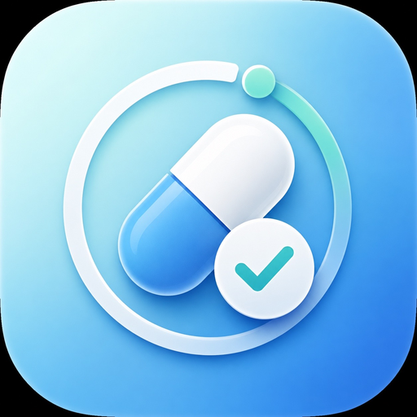

<div align="center">
  

# Luma V3.3

### Protocole & Journal

**Une PWA mobile-first, locale et offline pour suivre ses traitements, ses protocoles, ses événements et son journal quotidien.**

<br>


</div>

---

## Aperçu

**Luma** est une application web installable pensée comme un **carnet de bord personnel santé**. Elle permet d'organiser un protocole, de suivre les prises prévues, de noter les événements importants, de consulter un journal, d'exporter ses données et de garder une trace lisible du parcours.

Luma fonctionne **sans compte**, **sans cloud**, **sans serveur** et **sans publicité**. Les données restent stockées localement sur l'appareil via IndexedDB.

> [!IMPORTANT]
> Luma est un outil de suivi personnel. L'application ne donne pas de conseil médical, ne recommande pas de dosage et ne remplace jamais l'avis d'un professionnel de santé.

---

## Sommaire

- [Fonctionnalités principales](#fonctionnalités-principales)
- [Écrans de l'application](#écrans-de-lapplication)
- [Données et confidentialité](#données-et-confidentialité)
- [Installation locale](#installation-locale)
- [Déploiement GitHub Pages](#déploiement-github-pages)
- [Structure du projet](#structure-du-projet)
- [Modèle de données](#modèle-de-données)
- [Exports et imports](#exports-et-imports)
- [Sécurité et limites](#sécurité-et-limites)
- [Roadmap possible](#roadmap-possible)

---

## Fonctionnalités principales

| Module | Ce qu'il apporte |
|---|---|
| **Aujourd'hui** | Vue claire des prises et événements du jour, toujours calée sur la vraie date du jour. |
| **Timeline verticale** | Chronologie moderne des prises, événements et notes, avec rail vertical HTML/CSS. |
| **Journal** | Consultation par période, statistiques d'observance, symptômes, notes et exports. |
| **Protocoles** | Organisation des traitements par protocole avec statuts actif, pause, terminé ou archivé. |
| **Traitements** | Gestion des médicaments, phases et heures de prise. |
| **Événements** | Rendez-vous, examens, pharmacie, prises de sang, étapes personnalisées. |
| **Exports** | Sauvegarde JSON, export CSV compatible Excel et rapport imprimable. |
| **PWA offline** | Application installable, utilisable après premier chargement même sans réseau. |

---

## Écrans de l'application

### Aujourd'hui

L'écran principal affiche uniquement la journée réelle en cours. Il n'est pas modifié par les dates sélectionnées dans la Timeline.

Il permet de :

- voir les prises prévues aujourd'hui ;
- identifier les prises en retard ;
- marquer une prise comme **prise** ;
- passer une prise ;
- reporter une prise de 15 minutes ;
- annuler une action ;
- consulter les événements du jour ;
- saisir une note quotidienne et des symptômes.

Statuts possibles des prises :

| Statut | Signification |
|---|---|
| **En attente** | Prise prévue, pas encore traitée. |
| **En retard** | Heure passée sans action finale. |
| **Pris** | Prise marquée comme réalisée. |
| **Passé** | Prise volontairement passée. |
| **Reporté** | Prise repoussée via snooze. |

---

### Timeline verticale

La Timeline de Luma V3.3 est une vraie chronologie verticale HTML/CSS, conçue pour lire le protocole comme un parcours.

Elle affiche :

- les jours passés proches ;
- aujourd'hui ;
- les jours à venir ;
- les prises prévues ;
- les événements de protocole ;
- les notes quotidiennes ;
- les symptômes enregistrés ;
- les repères J1, J2, J3 selon la date de début du protocole.

La Timeline dispose aussi d'un filtre par protocole et d'un retour rapide à aujourd'hui.

---

### Journal

Le Journal est l'espace de consultation et de synthèse.

Il permet de filtrer les données par :

- 7 jours ;
- 30 jours ;
- 90 jours ;
- période personnalisée ;
- protocole.

Il affiche notamment :

- les prises comptabilisables ;
- les prises réalisées ;
- les prises passées ;
- les prises oubliées ;
- les prises reportées ;
- le taux d'observance ;
- le retard moyen ;
- les événements prévus et terminés ;
- les notes quotidiennes ;
- les symptômes.

> Les statistiques restent descriptives. Elles ne constituent pas une interprétation médicale.

---

### Traitements et protocoles

L'écran Traitements permet de gérer l'organisation complète du suivi.

#### Protocoles

Un protocole peut être :

| Statut | Comportement |
|---|---|
| **Actif** | Pris en compte dans Aujourd'hui, Timeline et Journal. |
| **En pause** | Suspendu, sans génération de faux oublis. |
| **Terminé** | Conservé pour consultation et export. |
| **Archivé** | Masqué des vues courantes par défaut. |

#### Médicaments et phases

Chaque médicament est rattaché à un protocole. Une phase définit :

- une date de début ;
- une date de fin optionnelle ;
- une ou plusieurs heures de prise ;
- un lien avec le médicament et le protocole.

Luma crée automatiquement un protocole par défaut nommé **Traitement principal** si aucun protocole n'existe.

---

### Notes et symptômes

Chaque journée peut contenir une note libre et un suivi simple des symptômes.

Symptômes proposés :

- nausée ;
- fatigue ;
- douleur ;
- maux de tête ;
- vertiges ;
- humeur ;
- sommeil ;
- saignement ;
- autre.

Échelle utilisée :

| Valeur | Niveau |
|---:|---|
| 0 | Aucun |
| 1 | Léger |
| 2 | Modéré |
| 3 | Fort |

Aucune alerte médicale automatique n'est générée à partir de ces données.

---

## Données et confidentialité

Luma stocke les données dans **IndexedDB**, directement dans le navigateur de l'utilisateur.

- Pas de compte utilisateur.
- Pas de serveur.
- Pas de synchronisation cloud.
- Pas de données envoyées à un tiers.
- Export manuel possible à tout moment.
- Pré-sauvegarde automatique avant import.

> [!WARNING]
> Les données locales peuvent être perdues si le navigateur ou le stockage du site est réinitialisé. Il est recommandé d'exporter régulièrement une sauvegarde JSON.

---

## Installation locale

Aucune compilation n'est nécessaire.

```bash
python3 -m http.server 8080
```

Puis ouvrir :

```txt
http://localhost:8080
```

Pour que la PWA et le service worker fonctionnent correctement, il est préférable d'utiliser un serveur local plutôt que d'ouvrir directement `index.html` depuis le système de fichiers.

---

## Déploiement GitHub Pages

Luma peut être déposée telle quelle dans un dépôt GitHub Pages.

Points importants :

- `manifest.json` utilise des chemins relatifs.
- `sw.js` met en cache les fichiers essentiels.
- Les icônes PWA sont disponibles dans `icons/`.
- L'application est compatible avec un sous-dossier GitHub Pages.

Exemple d'arborescence attendue :

```txt
/index.html
/manifest.json
/sw.js
/css/style.css
/js/*.js
/icons/icone_192x192.png
/icons/icone_512x512.png
```

---

## Structure du projet

```txt
Luma-3.3/
├── index.html
├── manifest.json
├── sw.js
├── Readme.md
├── css/
│   └── style.css
├── icons/
│   ├── icone_192x192.png
│   └── icone_512x512.png
└── js/
    ├── app.js
    ├── db.js
    ├── utils.js
    ├── intakes.js
    ├── today.js
    ├── timeline.js
    ├── journal.js
    ├── medications.js
    ├── settings.js
    ├── modal.js
    └── calendar.js
```

> `calendar.js` peut subsister comme ancien module ou reliquat technique, mais la navigation V3.3 s'articule autour d'Aujourd'hui, Timeline, Journal, Traitements et Réglages.

---

## Modèle de données

Luma V3.3 utilise la base locale :

```txt
luma_db
```

Version IndexedDB :

```txt
6
```

Stores principaux :

| Store | Rôle |
|---|---|
| `protocols` | Protocoles et leur statut. |
| `medications` | Médicaments rattachés aux protocoles. |
| `phases` | Périodes et horaires de prise. |
| `intakeActions` | État courant d'une prise. |
| `intakeEvents` | Historique des actions sur les prises. |
| `dailyNotes` | Notes quotidiennes et symptômes. |
| `protocolEvents` | Événements liés à un protocole. |

### Exemple d'export JSON

```json
{
  "app": "Luma",
  "version": "3.3",
  "exportedAt": "2026-05-24T10:00:00.000Z",
  "protocols": [],
  "medications": [],
  "phases": [],
  "intakeActions": [],
  "intakeEvents": [],
  "dailyNotes": [],
  "protocolEvents": [],
  "settings": {}
}
```

---

## Exports et imports

### Export JSON

L'export JSON est la sauvegarde complète de l'application. Il contient toutes les entités principales.

Nom généré :

```txt
luma-v3.3-backup-YYYY-MM-DD.json
```

### Import JSON

L'import accepte les structures historiques compatibles et valide les données avant écriture.

Avant un import valide, Luma télécharge automatiquement une sauvegarde de sécurité :

```txt
luma-pre-import-backup-YYYY-MM-DD-HHMM.json
```

### Export CSV

Le Journal peut être exporté en CSV compatible Excel français :

- encodage UTF-8 avec BOM ;
- séparateur `;` ;
- filtres période/protocole respectés ;
- prises, événements, notes et symptômes inclus.

### Rapport imprimable

Le Journal peut générer un rapport HTML imprimable ou enregistrable en PDF depuis le navigateur.

Le rapport inclut :

- période ;
- protocole ;
- statistiques ;
- détail journalier ;
- prises ;
- événements ;
- symptômes ;
- notes ;
- mention de non avis médical.

---

## Sécurité et limites

### Sécurité applicative

Luma applique une logique d'échappement HTML sur les données utilisateur affichées afin de limiter les injections dans l'interface.

Sont notamment concernés :

- noms de médicaments ;
- noms de protocoles ;
- notes libres ;
- événements ;
- champs importés ;
- rapport imprimable.

### Limites assumées

Luma ne propose pas :

- de recommandation médicale ;
- de calcul de dose ;
- d'alerte médicale automatique ;
- de synchronisation cloud ;
- de compte utilisateur ;
- de chiffrement avancé ;
- de notifications garanties sur tous les appareils.

---

## Roadmap possible

Idées d'amélioration futures, sans les rendre indispensables :

- notifications locales optionnelles si la compatibilité iOS/PWA est satisfaisante ;
- mode discret pour masquer les noms de médicaments ;
- amélioration graphique des statistiques ;
- recherche avancée dans le Journal ;
- export HTML plus personnalisable ;
- nettoyage ou archivage assisté des anciens protocoles.

---

## Philosophie du projet

Luma cherche à rester :

- **simple** : pas de compte, pas de cloud, pas de surcouche inutile ;
- **local** : les données restent sur l'appareil ;
- **lisible** : les actions importantes sont visibles rapidement ;
- **rassurant** : l'interface privilégie la clarté et la douceur ;
- **non prescriptif** : Luma suit, mais ne décide jamais.

<div align="center">

<br>

**Luma V3.3**  
_Un carnet de bord personnel santé, rangé comme une trousse bleue et calme._

</div>
